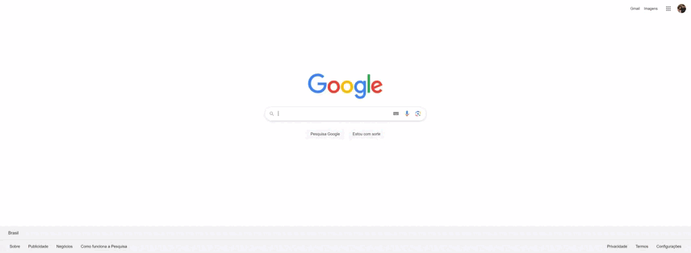

# Campeonato API e Frontend

Projeto simples construído para exemplificar o consumo de uma API própria, utilizando Spring Boot 3.0 no backend e Angular 17 no frontend. Este projeto demonstra o uso de relacionamentos no backend, bem como o uso de DTO (Data Transfer Object). Além disso, são apresentadas as rotas e módulos no frontend.
## Este projeto tem a finalidade de mostrar a tabela dos ultimos 6 anos do campeonato Brasileiro e uma pequena descrição sobre o time.

## Tecnologias Utilizadas

- 
- 
- 
- Banco de dados H2 (em memoria) populado a partir de um script.
## Funcionalidades

- Backend:
  - Demonstração de relacionamentos entre entidades.
  - Uso de DTO para transferência de dados entre a camada de controle e serviços.
  - API RESTful para acesso aos dados.

- Frontend:
  - Implementação de rotas para navegação entre diferentes partes da aplicação.
  - Utilização de módulos para organizar e encapsular funcionalidades.

## Como Executar o Projeto

1. **Backend (SpringBoot3)**:
   - Clone este repositório.
   - Importe o projeto em sua IDE favorita.
   - Execute a aplicação Spring Boot.

2. **Frontend (Angular 17)**:
   - Navegue até o diretório `frontend` do projeto.
   - Instale as dependências com `npm install`.
   - Inicie o servidor de desenvolvimento com `ng serve`.

## Overview do projeto

